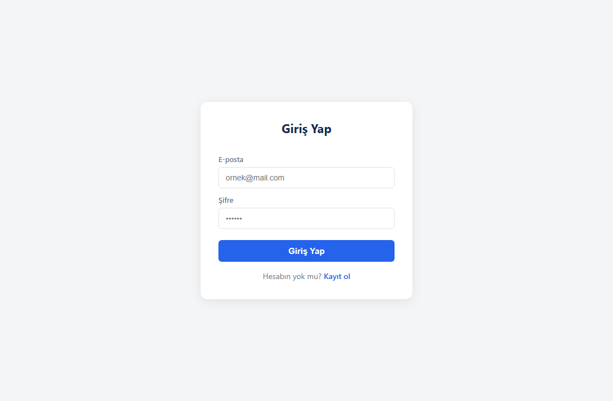
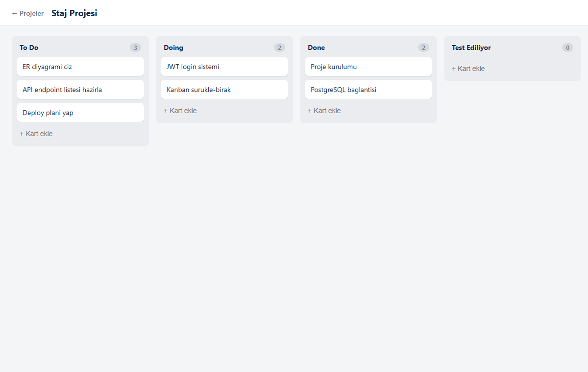
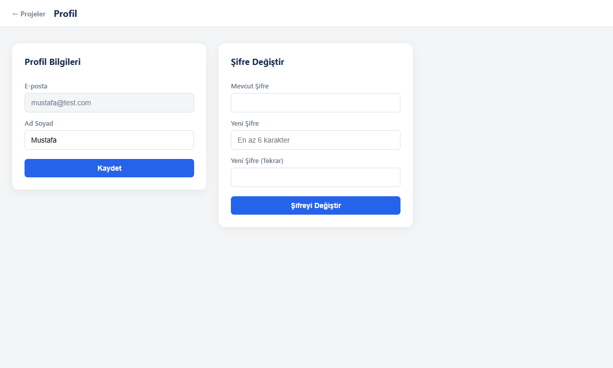

# Flowboard — Akıllı Görev & Proje Yönetim Sistemi (Trello Clone)

Ekiplerin proje açıp görev oluşturduğu, görevleri **sürükle-bırak** ile
"To Do / Doing / Done" sütunları arasında taşıyabildiği full-stack bir iş
yönetim sistemi.

## Özellikler
- 🔐 JWT tabanlı kayıt / giriş, bcrypt ile şifreleme
- 📋 Proje, sütun ve görev yönetimi (CRUD)
- 🧲 Sürükle-bırak ile kanban panosu
- 👥 Ekip çalışması (projeye üye ekleme, görev atama)
- 🧩 Özelleştirilebilir sütunlar
- 👤 Profil düzenleme ve şifre değiştirme
- 🛡️ Yetkilendirme (kullanıcı yalnızca üyesi olduğu projelere erişir)

## Teknolojiler
**Backend:** Node.js, Express, PostgreSQL, Prisma ORM, JWT, bcrypt, Zod
**Frontend:** React, Vite, React Router, Axios, @dnd-kit
**Altyapı:** Docker (PostgreSQL)

## Klasör Yapısı
```
trelloclone/
├─ backend/   Express + Prisma REST API
├─ web/       React kanban arayüzü
├─ docs/      Tasarım dokümanları ve ekran görüntüleri
└─ docker-compose.yml
```

## Kurulum

### 1. Veritabanı (Docker)
```bash
docker-compose up -d
```

### 2. Backend
```bash
cd backend
npm install
cp .env.example .env        # DATABASE_URL, JWT_SECRET, PORT değerlerini doldur
npx prisma migrate dev
npm run dev                 # http://localhost:4000
```

### 3. Frontend
```bash
cd web
npm install
npm run dev                 # http://localhost:5173
```

## Ekran Görüntüleri

### Giriş


### Kanban Panosu


### Profil / Şifre Değiştirme


## API Endpoint'leri (özet)
| Metod | Endpoint | Açıklama |
|-------|----------|----------|
| POST | `/api/auth/register` | Kayıt |
| POST | `/api/auth/login` | Giriş |
| GET | `/api/projects` | Projeleri listele |
| POST | `/api/projects` | Proje oluştur |
| GET | `/api/projects/:id` | Proje panosu (sütun + görev) |
| POST | `/api/columns/:id/tasks` | Göreve kart ekle |
| PUT | `/api/columns/:id/reorder` | Sürükle-bırak sıralaması |
